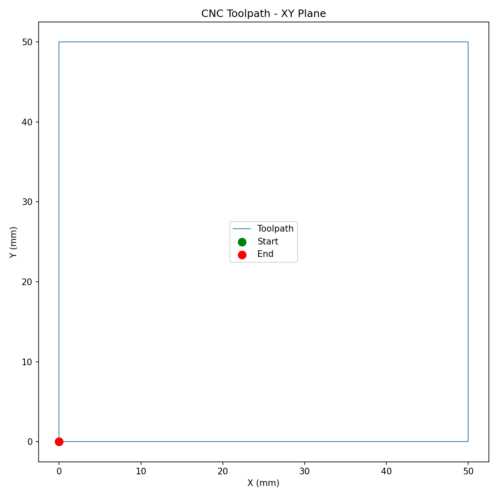
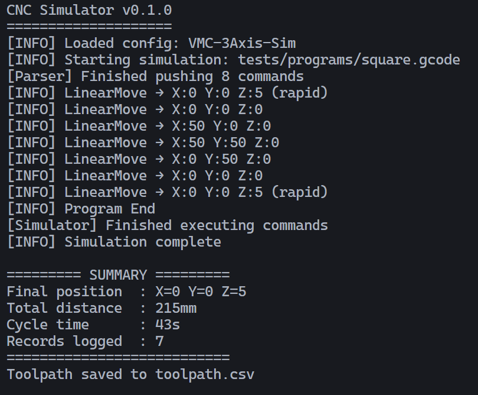

# ⚙️ CNC Virtual Simulator

> A real-time CNC machine simulator built in C++17.

The CNC Virtual Simulator parses industry-standard G-code programs and simulates the motion of a 3-axis CNC machine in real time; detecting errors, logging telemetry, and producing toolpath reports. Built to mirror the kind of low-level, performance-critical software used in real manufacturing and robotics systems.

---

## Demo

### Toolpath Plot


### Terminal Output


---

## Features

- **G-code parser** — tokenises and validates G-code programs (G0, G1, G2, G3, M-codes)
- **Motion engine** — computes linear and arc toolpaths with feed rate handling
- **Real-time simulation loop** — producer-consumer architecture using C++ threads
- **Telemetry logger** — records position, feed rate, and machine state at every step
- **Error detection** — catches overtravel, invalid commands, and feed rate violations
- **Machine configuration** — fully configurable axis limits and parameters via JSON
- **Toolpath report** — outputs a CSV of the full toolpath after each run
- **Python visualisation** — plots the XY toolpath from CSV using matplotlib

---

## Why I Built This

CNC machines, robotic arms, and automated manufacturing systems all share the same core software challenge: translating a high-level instruction (move here, at this speed) into precise, real-time machine control. This project implements that pipeline from scratch; G-code parsing, motion interpolation, real-time threading, and structured logging using only C++17 and the standard library.

It targets the same problem domain as industrial motion controllers used in CNC mills, 3D printers, and robotic end-effectors.

---

## Tech Stack

| Tool | Purpose |
|---|---|
| C++17 | Core application language |
| CMake 3.20+ | Build system |
| nlohmann/json | Machine configuration parsing |
| Google Test | Unit testing |
| Python 3 + matplotlib + pandas | Toolpath visualisation |
| STL (`variant`, `optional`, `thread`, `chrono`) | Modern C++ features throughout |

---

## Getting Started

### Prerequisites

- GCC 11+ or Clang 14+
- CMake 3.20+
- Git
- Python 3 with matplotlib and pandas

```bash
pip install matplotlib pandas
```

### Build

```bash
git clone https://github.com/louisnguyenn/cnc-virtual-sim.git
cd cnc-virtual-sim
mkdir build && cd build
cmake ..
cmake --build .
```

### Run

```bash
# default run
./build/cnc_simulator

# custom input file
./build/cnc_simulator --input tests/programs/square.gcode

# verbose logging
./build/cnc_simulator --verbose

# custom config and input
./build/cnc_simulator --config config/machine.json --input tests/programs/square.gcode

# help
./build/cnc_simulator --help
```

### Visualise the Toolpath

```bash
python3 scripts/visualise.py
```

Reads `toolpath.csv` and saves a 2D XY plot to `toolpath.png`.

### Run Tests

```bash
cd build
ctest --output-on-failure
```

---

## Key Concepts Demonstrated

- **std::variant** — type-safe representation of different G-code command types
- **std::optional** — safe return values from the parser when a line produces no command
- **std::thread & std::mutex** — producer-consumer simulation loop
- **std::condition_variable** — blocking queue with efficient thread synchronisation
- **std::chrono** — real-time motion timing and telemetry timestamps
- **OOP design** — Parser, MotionEngine, Logger as decoupled classes
- **Custom exceptions** — SimulatorException hierarchy for typed error handling
- **CMake FetchContent** — automatic dependency management
- **Google Test** — unit tests for the parser covering edge cases
- **Python + matplotlib** — post-run toolpath visualisation from CSV data

---

## Sample G-code Programs

A simple square toolpath (`tests/programs/square.gcode`):

```gcode
; Simple square toolpath
G90          ; absolute positioning
G0 X0 Y0 Z5  ; rapid move to start, safe height
G1 Z0 F100   ; plunge down
G1 X50 F300  ; cut right
G1 Y50       ; cut up
G1 X0        ; cut left
G1 Y0        ; cut back to start
G0 Z5        ; retract
M30          ; end program
```

---

## Credits
Louis Nguyen
