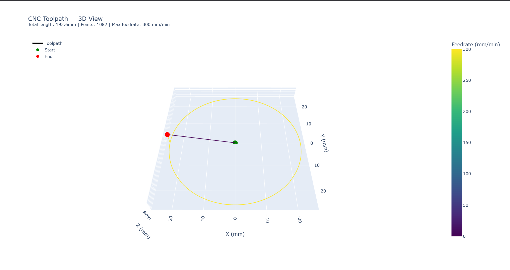

# ⚙️ CNC Virtual Simulator

> A real-time CNC machine simulator built in C++17.

The CNC Virtual Simulator parses industry-standard G-code programs and simulates the motion of a 3-axis CNC machine in real time; detecting errors, logging telemetry, and producing toolpath reports. Built to mirror the kind of low-level, performance-critical software used in real manufacturing and robotics systems.

---

## Demo

### 3D Toolpath Visualisation


### 2D Toolpath Plot


### Terminal Output


---

## Features

- **G-code parser** — tokenises and validates G-code programs (G0, G1, G2, G3, G4, M-codes)
- **Motion engine** — computes linear and arc toolpaths with full circle detection
- **Real-time simulation loop** — producer-consumer architecture using C++ threads
- **Telemetry logger** — records every interpolated position, feed rate, and machine state
- **Error detection** — catches overtravel, invalid commands, and feed rate violations
- **Machine configuration** — fully configurable axis limits and parameters via JSON
- **Severity-levelled logging** — DEBUG, INFO, WARN, ERROR with file and console output
- **Command-line interface** — `--config`, `--input`, `--verbose`, `--help` flags
- **Toolpath report** — outputs a full CSV of every interpolated point after each run
- **Python visualisation** — interactive 3D plotly visualisation and 2D matplotlib plot
- **numpy statistics** — path length, bounding box, and feedrate analysis

---

## Why I Built This

CNC machines, robotic arms, and automated manufacturing systems all share the same core software challenge: translating a high-level instruction (move here, at this speed) into precise, real-time machine control. This project implements that pipeline from scratch; G-code parsing, motion interpolation, real-time threading, and structured logging using only C++17 and the standard library.

It targets the same problem domain as industrial motion controllers used in CNC mills, 3D printers, and robotic end-effectors.

---

## Tech Stack

| Tool | Purpose |
|---|---|
| C++17 | Core application language |
| CMake 3.20+ | Build system |
| nlohmann/json | Machine configuration parsing |
| Google Test | Unit testing |
| Python 3 | Scripting and visualisation |
| pandas | CSV data loading |
| numpy | Toolpath statistics and math |
| matplotlib | 2D toolpath plot |
| plotly | Interactive 3D toolpath visualisation |
| STL (`variant`, `optional`, `thread`, `mutex`, `chrono`) | Modern C++ throughout |

---

## Getting Started

### Prerequisites

- GCC 11+ or Clang 14+
- CMake 3.20+
- Git
- Python 3 with required libraries

```bash
pip install matplotlib pandas numpy plotly
```

### Build

```bash
git clone https://github.com/louisnguyenn/cnc-virtual-sim.git
cd cnc-virtual-sim
mkdir build && cd build
cmake ..
cmake --build .
```

### Run

```bash
# default run
./build/cnc_simulator

# custom input file
./build/cnc_simulator --input tests/programs/square.gcode

# verbose logging
./build/cnc_simulator --verbose

# custom config and input
./build/cnc_simulator --config config/machine.json --input tests/programs/square.gcode

# help
./build/cnc_simulator --help
```

### Visualise the Toolpath

```bash
# 2D matplotlib plot — saves toolpath.png
python3 scripts/visualise.py

# 3D interactive plotly — saves toolpath3d.html
python3 scripts/visualise3d.py
xdg-open toolpath3d.html   # Linux
open toolpath3d.html        # macOS
```

### Run Tests

```bash
cd build
ctest --output-on-failure
```

---

## Project Structure

```
cnc-virtual-sim/
├── CMakeLists.txt
├── config/
│   └── machine.json              ← axis limits, feed rate caps, spindle config
├── assets/
│   ├── demo.png                  ← 2D toolpath plot
│   ├── toolpath3d.png            ← 3D toolpath screenshot
│   └── output.png                ← sample terminal output
├── scripts/
│   ├── visualise.py              ← 2D matplotlib toolpath plot
│   └── visualise3d.py            ← 3D plotly visualisation + numpy statistics
├── include/
│   ├── parser/
│   │   ├── GCommand.h            ← variant type for all command types
│   │   └── GcodeParser.h
│   ├── motion/
│   │   ├── Vec3.h
│   │   ├── MachineState.h
│   │   ├── MachineConfig.h
│   │   └── MotionEngine.h
│   ├── simulator/
│   │   ├── Simulator.h
│   │   ├── CommandQueue.h
│   │   ├── AppConfig.h
│   │   └── SimulatorException.h
│   └── logger/
│       ├── Logger.h
│       └── AppLogger.h
├── src/
│   ├── main.cpp
│   ├── parser/
│   ├── motion/
│   ├── simulator/
│   └── logger/
└── tests/
    ├── CMakeLists.txt
    ├── test_parser.cpp
    ├── test_motion.cpp
    └── programs/
        ├── square.gcode
        └── circle.gcode
```

---

## Key Concepts Demonstrated

- **std::variant** — type-safe representation of different G-code command types
- **std::optional** — safe return values from the parser when a line produces no command
- **std::thread & std::mutex** — producer-consumer simulation loop
- **std::condition_variable** — blocking queue with efficient thread synchronisation
- **std::chrono** — real-time motion timing and telemetry timestamps
- **OOP design** — Parser, MotionEngine, Logger as decoupled classes
- **Custom exceptions** — SimulatorException hierarchy for typed error handling
- **Singleton pattern** — AppLogger accessible globally with a single instance
- **CMake FetchContent** — automatic dependency management
- **Google Test** — unit tests for parser and motion engine
- **Python + plotly + numpy** — interactive 3D toolpath visualisation and statistics

---

## Sample G-code Programs

**Square toolpath** (`tests/programs/square.gcode`):

```gcode
; Simple square toolpath
G90           ; absolute positioning
G0 X0 Y0 Z5   ; rapid move to start, safe height
G1 Z0 F100    ; plunge down
G1 X50 F300   ; cut right
G1 Y50        ; cut up
G1 X0         ; cut left
G1 Y0         ; cut back to start
G0 Z5         ; retract
M30           ; end program
```

**Circle toolpath** (`tests/programs/circle.gcode`):

```gcode
; Circle toolpath — 25mm radius
G90
G0 X25 Y0 Z5          ; rapid to start position
G1 Z0 F100            ; plunge down
G2 X25 Y0 I-25 J0 F300 ; full clockwise circle
G0 Z5                 ; retract
M30                   ; end program
```

---

## Credits
Louis Nguyen
